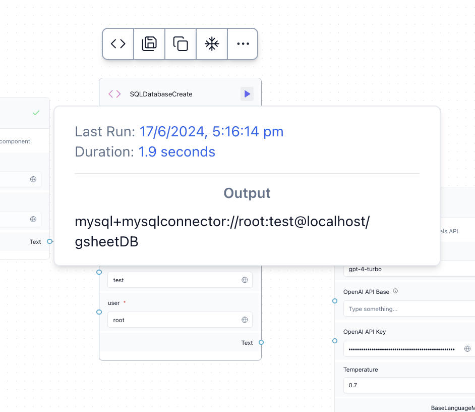
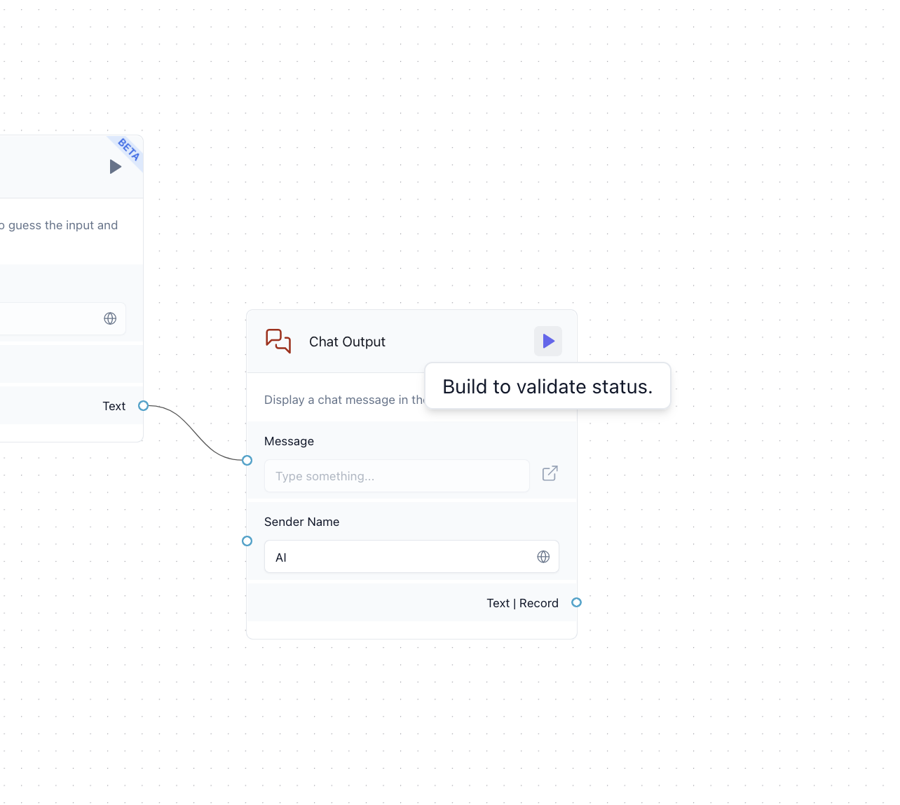
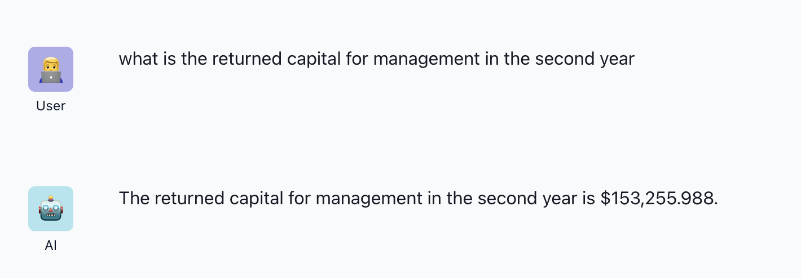
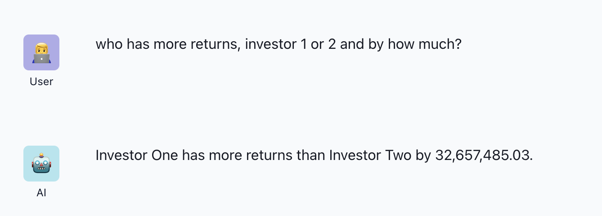

# Excel-Sheet-Chat-Bot

## Setup

1. install dependencies using ```pip install -r requirements.txt```
2. create a mysql server using ```mysql -u {username} -p{password}```
3. use ```langflow run``` and open interface using the access url
4. from google sheets export file as ```.xlxs``` and copy absolute ```PATH``` of file, example - ```/Users/tanishq/Desktop/Ema/Ema.xlsx```

## Demo 

1. create new blank project in langflow and import the file ```SQL-Agent.json``` provided in the repo
2. to view source code of any component, hover over it and use the ```<>``` button
3. in ```XLSXComponent``` enter ```PATH``` (of ```.xlxs``` file)
4. in ```OpenAI``` and ```ChatOpenAI``` component, enter GPT4 API key
5. in ```SQLDatabaseCreate``` enter host: ```localhost```, user: ```{username}```, password: ```{password}```
6. build the component ```SQLDatabaseCreate``` and copy the generated output database URI



7. enter the database URI in ```SQLAgent```
8. build ```Chat Output```


9. use the playground to interact with the chat-bot


