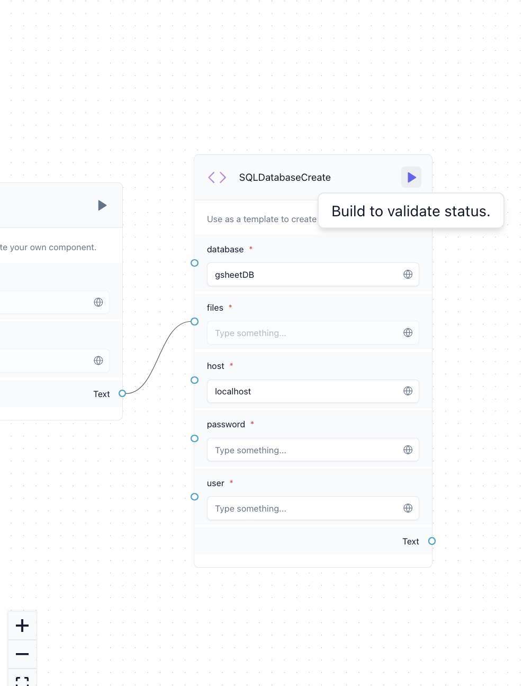

# Excel-Sheet-Chat-Bot

## Setup

1. install dependencies using ```pip install -r requirements.txt```
2. create a mysql server using ```mysql -u {username} -p{password}```
3. use ```langflow run``` and open interface using the access url
4. from google sheets export file as ```.xlxs``` and copy absolute ```PATH``` of file, example - ```/Users/tanishq/Desktop/Ema/Ema.xlsx```

## Demo 

1. in ```XLSXComponent``` enter ```PATH``` (of ```.xlxs``` file)
2. in ```OpenAI``` and ```ChatOpenAI``` component, enter GPT4 API key
3. in ```SQLDatabaseCreate``` enter host: ```localhost```, user: ```{username}```, password: ```{password}```
4. build the component ```SQLDatabaseCreate``` and copy the generated output database URI


6. enter the database URI in ```SQLAgent```
7. build ```Chat Output```

8. use the playground to interact with the chat-bot


